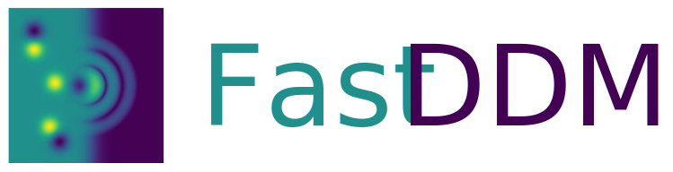

[](https://github.com/somexlab/fastddm/actions/workflows/test.yml)
[](https://pypi.org/project/fastddm/)
[](https://fastddm.readthedocs.io/en/latest/?badge=latest)
[](LICENSE)

**FastDDM** is a Python package for the analysis of microscopy image sequences using Differential Dynamic Microscopy on CPU and GPU.
The features implemented are targeted at the experimental soft matter research community dealing with inert and active/biological samples.

## Resources
- [Documentation](https://fastddm.readthedocs.io/):
  Python API description, installation, examples, and usage information.
- [Example notebooks](https://github.com/somexlab/fastddm-tutorials):
  Jupyter notebooks with practical examples.

## Example scripts
These examples demonstrate some of the Python API.

Calculation of the image structure function and its azimuthal average:

```python
import fastddm as fddm

file_names = [...]  # define here your list of image file names 
images = fddm.read_images(file_names)

pixel_size = 0.3    # um
frame_rate = 50     # frames per second
    
# compute image structure function and set experimental parameters
dqt = fddm.ddm(img_seq, range(1, len(img_seq)))
dqt.pixel_size = pixel_size
dqt.set_frame_rate(frame_rate)

# compute the azimuthal average
aa = fddm.azimuthal_average(dqt, bins=dqt.shape[-1] - 1, range=(0.0, dqt.ky[-1]))
```

## Contributing to FastDDM
Contributions are welcome via [pull requests](https://github.com/somexlab/fastddm/pulls) after
agreeing to the [Contributors' Agreement](https://github.com/somexlab/fastddm/CONTRIBUTING.rst).
Please, refer to the [Developers'](https://fastddm.readthedocs.io/en/latest/contributing.html) section in the documentation.

Please, report bugs and suggest features via the [issue tracker](https://github.com/somexlab/fastddm/issues).

## Citing FastDDM
Please, cite this publication in every work that uses FastDDM:

    E. Lattuada, F. Krautgasser, F. Giavazzi, and R. Cerbino.
    The Hitchhiker’s Guide to Differential Dynamic Microscopy.
    (In preparation.)

## License
FastDDM is available under the [GNU GPL-3.0 license](LICENSE).

## Acknowledgements
* The [fftw-3.3.10](https://www.fftw.org/) and [pybind11 2.12.0](https://github.com/pybind/pybind11) libraries are included in the source tree.
* This project was funded by the Austrian Science Fund (FWF), Grant Number M 3250-N.
